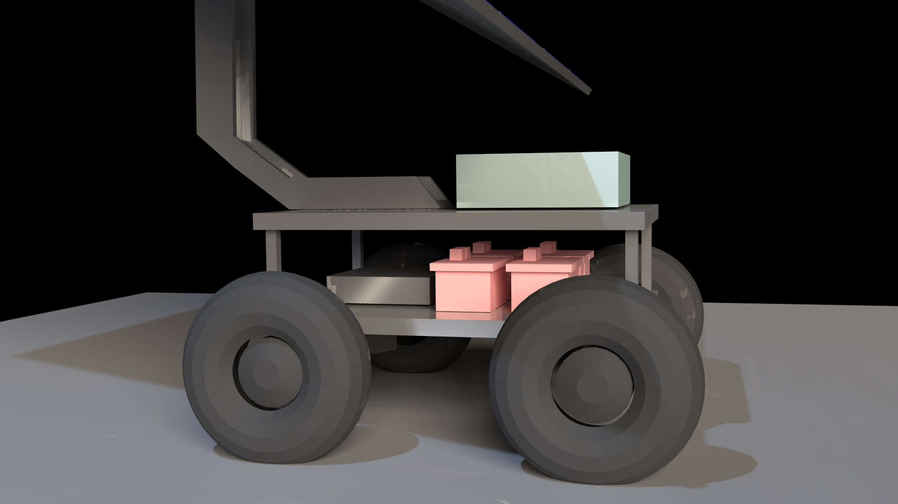

# MESA-Lab @ UMD
The goal of the MESA lab is to provide education for topics related to renewable energy.
The core language being used is Python 2.7, 3.5 and C++

Currently there two ongoing projects:
1. The design of an education cross platform application for visual representation of related topics
2. Design for control of an adult-sized rover.

# Sample image of the rover
Image was rendered via blender.

## Software dependencies:
1. Kivy python3
    Please visit [kivy](kivy.org) 
    ` apt-get install python3-kivy `
2. numpy and scipy [numpy](numpy.org "Numpy") [Scipy](Scipy.org "Scipy")
3. ROS 
    -Visit [ROS](ros.org)
4. OpenCV 3.0 [OpenCV](opencv.org)

Note:: Anaconda is a useful platform to have that contain many modules helpful in data science  
[Anaconda](https://www.continuum.io/ "Anaconda")

## Hardware:
* Raspberry Pi 3
* Sunfounder Video Car [Amazon link](https://www.amazon.com/SunFounder-Raspberry-Robotics-Electronic-Included/dp/B014KK89BW/ref=sr_1_1?ie=UTF8&qid=1494105927&sr=8-1&keywords=sunfounder+video+car "Video Car")
